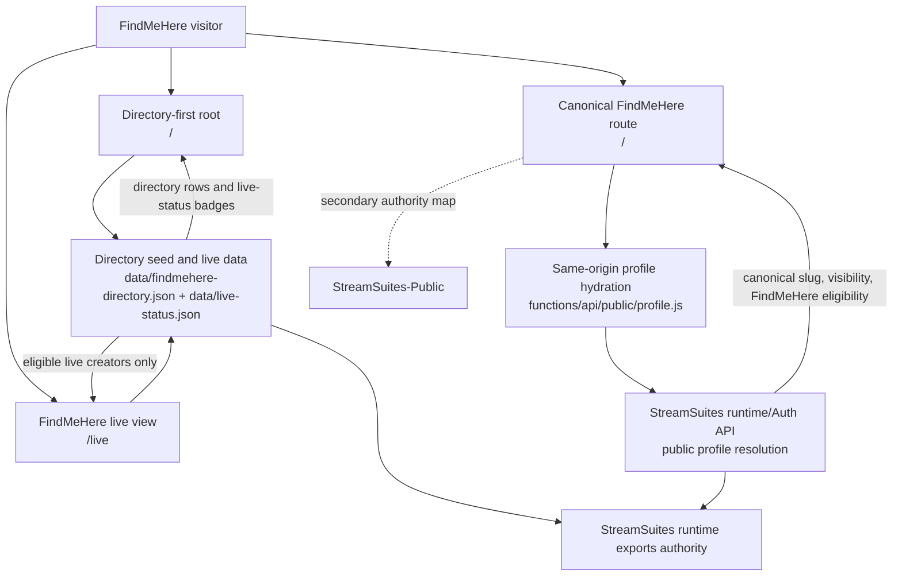

# StreamSuites-Members

Standalone FindMeHere surface deployed to Cloudflare Pages at `https://findmehere.live`.

## Release State

- README state prepared for `v0.4.2-alpha`.
- This repo is the active FindMeHere web surface, not a members shim.
- Historical members-era files remain only where they still support compatibility redirects or shared styling.

## Scope & Authority

- This repo is the share-first FindMeHere surface, not the canonical account or profile authority.
- Canonical slug assignment, profile visibility, and FindMeHere eligibility remain runtime/Auth-owned in `StreamSuites`.
- The repo consumes directory seed data, same-origin public profile hydration, and exported runtime live-status payloads to render the directory, root-slug pages, and live view.
- Login, signup, and profile-management actions intentionally route users back to StreamSuites where account and profile authority live.

## Repo-Scoped Flowchart



## Current Surface Model

- `/` is the directory-first discovery surface.
- `/<slug>` is the canonical FindMeHere public profile route.
- `/live` is the dedicated FindMeHere live view and filters against authoritative FindMeHere eligibility plus the centralized `live-status` payload.
- Same-origin public profile hydration runs through `functions/api/public/profile.js`.
- Directory hydration starts from `data/findmehere-directory.json`, which carries canonical slug and FindMeHere surface fields from the authoritative runtime export.
- Profile rendering is share-first: FindMeHere is the primary route and share action, while StreamSuites profile links are secondary outbound links when the authoritative payload provides them.
- Live badges, live rings, live-directory cards, and live banner treatment consume authoritative runtime `live_status` exports first, with optional Rumble discovery enrichment only when existing watch/title metadata is missing.
- Login, signup, and profile-management flows intentionally send users back to StreamSuites where account and profile authority lives.

## Routing Notes

- `_redirects` rewrites root-slug profile routes back into the SPA entry while preserving compatibility redirects from older `/u/:slug`, `/members`, `/notices`, and `/settings` paths.
- The active root profile experience is implemented from `index.html` plus `js/findmehere-app.js`.
- Legacy `/u/index.html` remains in the repo as compatibility scaffolding, but canonical FindMeHere links now resolve on `/<slug>`.

## Cross-Repo Orientation

- Top-level authority map: [StreamSuites runtime README](https://github.com/BSMediaGroup/StreamSuites)
- Canonical public-surface detail: [StreamSuites-Public README](https://github.com/BSMediaGroup/StreamSuites-Public)
- Creator-surface detail: [StreamSuites-Creator README](https://github.com/BSMediaGroup/StreamSuites-Creator)
- Admin-surface detail: [StreamSuites-Dashboard README](https://github.com/BSMediaGroup/StreamSuites-Dashboard)

## Repo Tree

```text
StreamSuites-Members/
├── .gitignore
├── _redirects
├── BUMP_NOTES.md
├── README.md
├── favicon.ico
├── index.html
├── changelog/
│   └── v0.4.2-alpha.md
├── auth-complete/
│   └── index.html
├── functions/
│   └── api/
│       └── public/
│           └── profile.js
├── assets/
│   ├── css/
│   │   └── ss-profile-hovercard.css
│   ├── js/
│   │   └── ss-profile-hovercard.js
│   ├── icons/
│   │   ├── [platform and tier icons]
│   │   └── ui/
│   │       └── [shared UI icons]
│   ├── logos/
│   │   ├── logo.png
│   │   └── logocircle.png
│   └── placeholders/
│       └── defaultprofilecover.webp
├── css/
│   ├── findmehere.css
│   ├── members.css
│   ├── public-shell.css
│   └── theme-dark.css
├── data/
│   ├── findmehere-directory.json
│   ├── live-status.json
│   ├── notices.json
│   └── profiles.json
├── js/
│   ├── findmehere-app.js
│   ├── members-app.js
│   ├── members-auth-complete.js
│   ├── members-data.js
│   ├── members-session.js
│   ├── members-shell.js
│   ├── members-toast.js
│   ├── members-ui.js
│   └── profile-app.js
├── tests/
│   └── live-status-authority.test.mjs
├── members/
│   └── index.html
├── notices/
│   └── index.html
├── settings/
│   └── index.html
└── u/
    └── index.html
```
